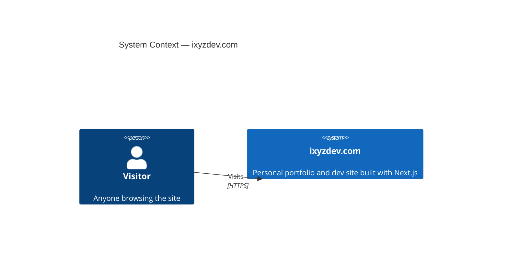
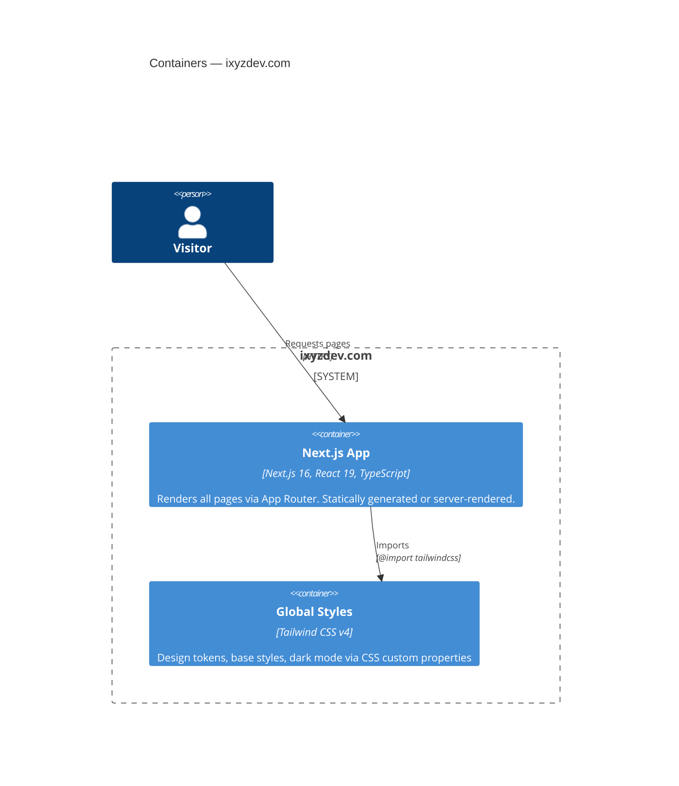
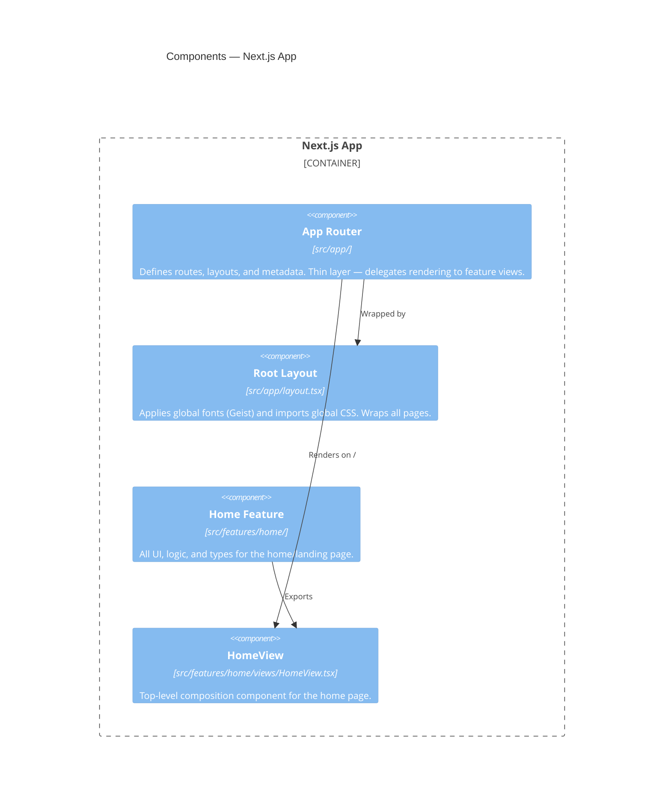

# Architecture

## Feature-based structure

Each feature is a self-contained module under `src/features/<feature-name>/`. It owns everything related to that domain: views, components, hooks, types, and utilities.

```
src/features/<feature>/
├── views/          # Top-level page compositions (rendered by app router pages)
├── components/     # UI components scoped to this feature
├── hooks/          # React hooks scoped to this feature
├── types/          # TypeScript types and interfaces
└── utils/          # Helper functions
```

`src/app/` pages are intentionally thin — they only import and render the corresponding feature view:

```tsx
// src/app/page.tsx
import { HomeView } from "@/features/home/views/HomeView"
export default function HomePage() {
  return <HomeView />
}
```

This keeps the App Router as a routing layer only, separating routing concerns from UI logic.

---

## C4 Model

### Level 1 — System Context



---

### Level 2 — Containers



---

### Level 3 — Components (Next.js App)



---

### Conventions for new features

When adding a new route (e.g. `/about`):

1. Create `src/features/about/views/AboutView.tsx`
2. Create `src/app/about/page.tsx` that only imports and renders `<AboutView />`
3. Add sub-directories (`components/`, `hooks/`, etc.) only as needed — don't create empty folders upfront
